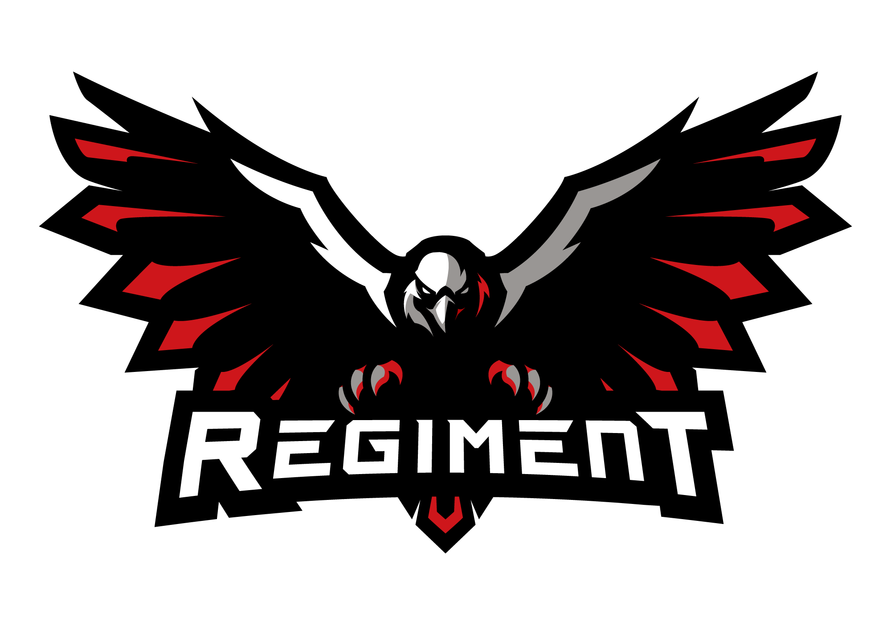

# Regiment Lite Adventures

> **Lightweight • Vanilla+ • Official Regiment Gaming Community Pack**

The perfect balance of vanilla Minecraft with just enough quality-of-life polish to make everything feel smooth, fair, and fun.  
No new dimensions, no tech trees, no overhauls. Only small, rock-solid enhancements.

Regiment Lite Adventures is a hand-crafted modpack for the Regiment Gaming Community. It brings together a carefully chosen set of QoL, performance, and decorative mods that enhance Minecraft without ever changing the core experience you know and love.  
It improves performance, simplifies inventory management, adds subtle visual polish, and keeps FPS high; all while staying beginner-friendly and true to vanilla.

- **Mod count**: ~79 hand-picked mods  
- Runs beautifully on machines that can already handle vanilla

## Current Version
**v0.6.1** – Minecraft 1.21.1 • NeoForge 21.1.143  
[Download Latest Release](https://github.com/BDTheNerdyMedic/regiment-lite-adventures/releases/latest) • [Full Mod List](modlist.html) • [Changelog](CHANGELOG.md)

## Why Regiment Lite Adventures?
- Quality-of-life, performance, and decorative mods
- Upcoming community-crafted, lore-friendly trinkets (starting with the **Regiment Medallion**!)
- Active and friendly Regiment Gaming Discord
- Nearly every addition is voted on by the community

## Quick and Easy Install
Search **Regiment Lite Adventures** on CurseForge and install with your favorite launcher (Prism, CurseForge App, MultiMC, etc.)

## Roadmap

### Short-Term – v0.7.0 (Next 2–4 Weeks)
- Wait for **Minecraft 1.21.11** + stable NeoForge 21.11.x
- Update all core mods to their latest 1.21.11 versions
- **Target**: within 10 days of 1.21.11 full release
- **World reset required** – announcement 2 weeks ahead

### Mid-Term – Q1 2026
- Continue monitoring mods for stability updates
- Release first custom item: **Regiment Medallion**
- Add 2–3 community-voted, pure QoL mods
- **No world reset** this cycle

### Long-Term Vision
- Always prioritize performance and engaging, lightweight content
- Every enhancement driven by community feedback and polls
- Keep the pack forever beginner-friendly and true to vanilla

## Join Regiment!
Discord → https://discord.gg/regiment  
Server IP → Join the Discord and request to be whitelisted in the #minecraft channel

Built with ❤️ by **BDTheNerdyMedic** and the Regiment Minecraft Community.